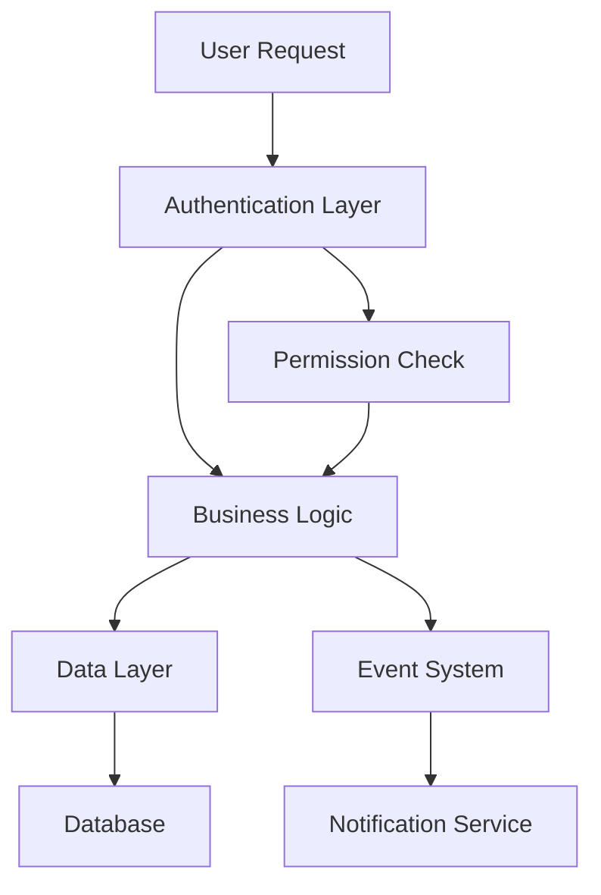

# A New Frontier

I can't believe where I'm at today.

I've had Claude 4 Sonnet build an entire suite of simple applications that
interact with one another. I have had a hand in specifying some of the
architecture and some of the abstractions. However, I only craft these
instructions through human language! I'm telling Claude what to do over time. I
still have to intervene. Claude makes mistakes. Sometimes it gets completely
stuck trying to correct them and I've had to do some debugging for them.

It's a very interesting process... it's different than how I used to work for
sure.

I realized very quickly that the AI could not construct the quality and
extensible interfaces for library code I wanted from it. Instead, I think we'll
have to isolate regions of the codebase to work on and have ways to enhance how
the models think about developing code. There is immense value inside of AI
tooling as far as my experiments have gone. Although it's clear we still need
humans — and indeed I want to be in the loop because I love programming!

This post is the first of many where I dive into LLM models as an expert
software engineer, intermediate data scientist, and novel LLM engineer.

## The Beginning

I start the day wondering about agentic AI. I lead a group of engineers working
on an incredible product whose one of many uses is fighting fraud. The rise of
agentic AI will lead us to a time where automated fraud will be easier than ever
before! Fraud... but also good agents doing work for good users. We want to be
able to identify and classify these agents.

This setting led me down a rabbit hole to look at building my own agent to see
what it is capable of. I decide to use AI to build these agents. I'm using a
combination of many tools: NotebookLM, ChatGPT, Cursor (with Claude). Most
importantly, though, I'm going to be building my own agents! I needed to build
some custom tools for my research and thought, "could AI build the tools I need
to teach AI to do the things I need to do?"

This rabbit hole goes deep. I immediately dive into LLMs and their structure. I
recall when ChatGPT was released and I read the paper that transformed (haha) it
all: "All you need is attention". This is the Google whitepaper that built the
structure needed for neural networks to pay attention to their surroundings.
Literally their surroundings, the words around a given word can now be included
as "context". Context is the name of the game with LLMs, which are responsible
for generating the N+1 token from a sequence of N tokens.

> **The Fundamental Insight**: LLMs work by generating the next token from the
> prior sequence. That's their entire power! They use context to inform this
> prediction. Understanding that context influences how these models "think"
> will let us influence their operation. This is the subtle art of AI-assisted
> development.

<!-- We're going to include an image here of the LLM generation loop -->

I download Cursor, a recommended coding client, and I'm set to get started. I
will note that this will be AI-assisted development, but I'm going to adhere to
two major principles:

1. **The AI does as much work as possible**
2. **I do any critical section work, or at least verify it**

## The Goal

What am I making? We're making our own agents. Several folks do this already,
this time may or may not be different. I'm an engineer building tooling for
robots to build more robots — we'll see how this goes.

I will build my own agent stack. We may even run some models locally to
completely isolate the chance of any of our data being sent to corporations. If
I could run and fine-tune a local development model... I am truly living in the
future. I don't have the hardware to do this, so we're going to start by using
these commercial ones.

**We're going to build our own custom agents! From the ground, engineering them
— or attempting to — _through_ the AI tools as much as possible.**

### The Meta-Challenge

There's something beautifully recursive about this endeavor: using AI to build
AI. It's like asking a compiler to compile itself, or using a programming
language to write its own interpreter. The philosophical implications are
staggering, but the practical ones are what keep me up at night.

I'm essentially trying to bootstrap an AI development environment where the
primary developer is... another AI. The human becomes the architect, the
visionary, the quality control specialist — but not necessarily the one writing
every line of code.

## Will It Work?

I'm skeptical that AI can build anything of significant complexity. Where is
that line drawn? There are several attempts at getting AI to build all sorts of
complex applications. One of my ulterior goals is to uncover a system of working
with agent systems to develop significantly complex software! I'm certain there
is at least some way to incorporate these tools beyond autocomplete suggestions.

### The Critical Sections

If we get to things like authentication and resource permissions, protecting and
sandboxing an environment, or critical performance situations, these are the
types of things I'm worried about AI developing alone. These aren't just coding
problems — they're security problems, architecture problems, problems that
require deep understanding of systems and their failure modes.

Consider these scenarios:

- **Authentication Systems**: Can an AI properly implement OAuth flows,
  understand JWT security implications, or design proper session management?
- **Resource Permissions**: Will it understand the principle of least privilege,
  proper access control matrices, or the subtleties of role-based permissions?
- **Performance Critical Code**: Can it optimize database queries, understand
  memory management, or design efficient algorithms for scale?

### The Extensibility Problem

I'm also worried about extensibility of the software itself. What will happen if
I need to add code to some part of the application? Will it be easy enough to
do? It is in this vein that gives me consideration for developing a way to
communicate my ideas and architectures to LLMs in some sort of structured way.

Maybe I'll finally find a real use for some UML style diagramming or
interpretation of structure!? The idea of having a formal way to describe system
architecture that an AI can understand and work with is tantalizing. Imagine
being able to:



And then saying to the AI: "Implement this architecture, following these
patterns, with these specific security considerations..."

## The Learning Process

What I've discovered so far is that AI-assisted development isn't just about
getting code written faster. It's about developing a new kind of dialogue with
the machine. You have to learn to:

### Communicate Intent Clearly

Traditional programming is about translating your intent into precise
instructions. AI-assisted development is about communicating your intent in
natural language, but with enough precision that the AI can translate it into
good code.

```javascript
// Instead of writing this directly:
const authenticatedUser = await validateToken(request.headers.authorization);
if (!authenticatedUser) {
  return response.status(401).json({ error: "Unauthorized" });
}

// I might say: "Add authentication middleware that validates JWT tokens
// and returns 401 for invalid tokens"
```

### Iterate on Architecture

The AI is surprisingly good at taking architectural feedback and adjusting. When
I say "this approach won't scale, let's use a message queue instead," it can
often refactor entire sections of code to accommodate that change.

### Debug Collaboratively

When something goes wrong, I can describe the problem in natural language: "The
user creation flow is failing when we try to send welcome emails" and the AI can
often identify the issue and propose fixes.

## The Current State of the Art

Right now, I'm working with:

- **Cursor**: An AI-powered code editor that feels like having a pair programmer
  who never gets tired
- **Claude 4 Sonnet**: For complex architectural discussions and code generation
- **ChatGPT**: For quick problem-solving and brainstorming
- **NotebookLM**: For research and understanding complex domains

Each tool has its strengths. Cursor excels at in-context code completion and
refactoring. Claude is brilliant at understanding complex requirements and
translating them into architecture. ChatGPT is great for quick questions and
debugging sessions.

But here's what's fascinating: **the combination is greater than the sum of its
parts**. When you can seamlessly move between natural language architecture
discussions and precise code implementation, something magical happens. The
development process becomes more fluid, more exploratory, maybe even more
interesting?

I know there's some middle ground in here where I can still enjoy solving fun
programming problems, architecting complex systems, and optimizing performance
issues while simultaneously increasing my productivity through the use of
further automation.

## One Misgiving

While I am extremely excited at the prospect of getting so much automation going
that we could build an entire application somehow. I do think that one of the
most important lacking abilities in these LLMs is abstract construction. What I
mean by this is how I think about writing software. I have a mathematics and
software background so I tend to think of things quite abstractly. I don't
currently believe that these models can 'think' in the same way that I do about
building systems.

If I'm building a piece of logging infrastructure for a high performance
critical section on a restricted resource machine, low RAM, CPU, etc. I would
think about very many potential interferences logging could cause. If we ship
logs to another thread, how does that affect throughput? If we're flushing logs
in batches, how will that affect the memory footprint and disk contention? Do we
require synchronicity in any form? What about conditional-evaluation logging
(under some condition, do additional processing and log that, avoiding the
processing if the condition is false)? There are so many things to think about
and we haven't even started designing the software interface itself.

Somewhere in here, there is value.

## Next Up

In the next post, I'll cover the tech stack I ended up building. This article
has been written after starting my agent work, so I'll cover everything I've
gone through so far. I am so far equally impressed as I am skeptical, which is
the perfect mix to employ the use of AI tools in production use cases.

I'll dive deep into:

- **The Architecture**: How I structured the agent system
- **The Tools**: What worked, what didn't, and why
- **The Process**: My workflow for AI-assisted development
- **The Results**: What I was able to build and how it performed
- **The Lessons**: What I learned about the future of software development

### What's at Stake

This isn't just about building better tools or writing code faster. This is
about fundamentally changing how we think about software development. We're
potentially looking at a future where:

- **The role of the programmer evolves** from code writer to system architect
  and AI collaborator
- **Software complexity can scale** beyond what individual humans can manage
- **The barrier to entry for creating software** drops dramatically
- **New forms of software** become possible that we can't even imagine yet

But we're also looking at risks: systems we don't fully understand, code that's
harder to debug, security vulnerabilities we can't predict, and the potential
obsolescence of traditional programming skills.

## P.S.

This blog will also be entirely written with AI assistance, other than these
blog posts which will be written tool-assisted. I will try to train the model
that writes these posts in my style so it mimics the blend of AI and human that
this experiment represents.

The recursive nature of this project continues to amaze me: I'm using AI to
write about using AI to build AI systems. At some point, we might need to ask
whether we're still in control of this process, or if the AI is using us to
build more AI.

But for now, I'm enjoying the ride. Welcome to the frontier.

---

_This post represents my authentic experience with AI-assisted development. All
code examples and architectural decisions were made in collaboration with AI
systems, but the insights, skepticism, and wonder are entirely human._
