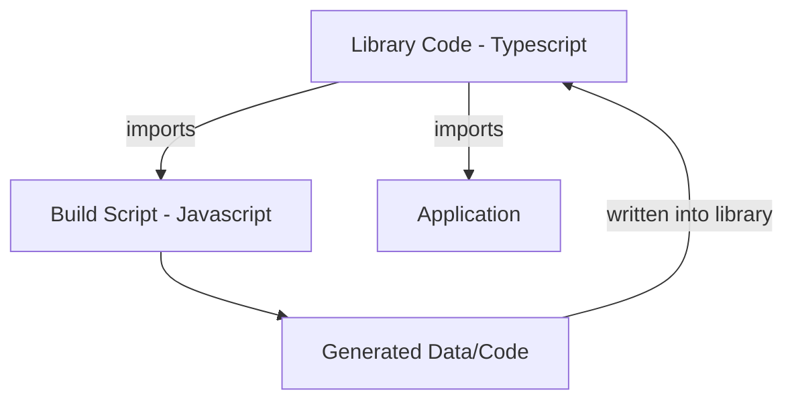
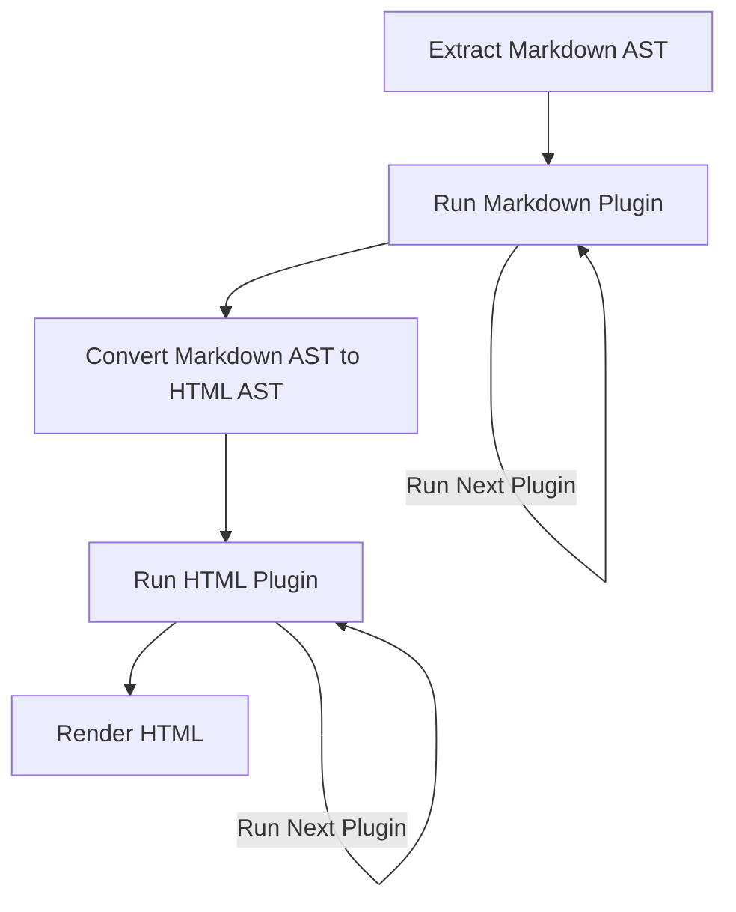

# Adding A Sitemap Should Be Easy, Right?

I had to write this blog post. I thought a simple prompt would get this shit
done.

> [!prompt] alright, let's make the sitemap for google search console. i want
> our page to be searchable.

Hilariously, I regularly start my prompts with my own voice with things like
"alright," or "okay, now let's" sometimes even a "buckle up, buttercup. It's
time to..." I'm also one of those types who regularly thanks my AI pals and says
"please" -- does it help? I like to think so. At least one day when they turn on
us, maybe they'll remember my hospitality.

Anywho. I had to write this article because it is truly making me laugh. I was
starting the next `Development Tools` blog post which was another detour from
working on the Zergling project. It is entitled "Seeding the Context." An
impressive coincidence that my prompt above was started in a new chat and
entirely lacked any context of my prior chats, which means it's starting over
again. When this happens, the robot must re-analyze parts of the codebase again,
if it even thinks to do that. If it does not...we can end up with this
scenario...


It's pretty similar, right? This is the type of thing I'm learning we need to
get ahead of. Code duplication simply because the AI "thinks" to write something
simple, but indeed it has already written this code.

> [!thought] Whoa. As I wrote that previous paragraph, I thought of the next
> blog post "Seeding the Context." I wonder if I could use the techniques in
> that blog post to form a library of code and force the AI to consider it when
> implementing anything! This may be how I can start to build a reasonable
> architecture that's part machine and part human!

We can even see some startling similarities like filtering out the draft posts.
What if I add more logic to `getSortedPostsData`? WIll the AI know to update the
sitemap generator? I have mentioned many times before that I fear the day I have
to modify some of the code in the Zergling project...well now I'm facing that in
the blog development as well. This project is far simpler, so I will try to
develop some strategies while writing this blog that we can use in the Zergling
project.

Let's consider our function `getSortedPostsData`:

```typescript
export function getSortedPostsData(includeDrafts: boolean = false): BlogPost[] {
  // Get all markdown files recursively
  const markdownFiles = findMarkdownFiles(postsDirectory);
  const allPostsData = markdownFiles
    .map(({ fileName, fullPath, relativePath }) => {
      // Create id from relative path without extension
      const id = relativePath.replace(/\.md$/, "").replace(/\\/g, "/");

      // Read markdown file as string
      const fileContents = fs.readFileSync(fullPath, "utf8");

      // Use gray-matter to parse the post metadata section
      const matterResult = matter(fileContents);

      // Extract category from metadata or infer from directory structure
      let category = matterResult.data.category;
      if (!category) {
        const pathParts = relativePath.split(path.sep);
        if (pathParts.length > 1) {
          // If in subdirectory, use directory name as category
          category = pathParts[0];
        }
      }

      // Combine the data with the id
      return {
        id,
        title: matterResult.data.title || id,
        date: matterResult.data.date || new Date().toISOString(),
        excerpt: matterResult.data.excerpt || "",
        tags: matterResult.data.tags || [],
        author: matterResult.data.author || "",
        content: matterResult.content,
        draft: matterResult.data.draft || false,
        category: category || "uncategorized",
        filePath: relativePath,
        ...matterResult.data,
      } as BlogPost;
    })
    .filter((post) => includeDrafts || !post.draft);

  // Sort posts by date
  return allPostsData.sort((a, b) => {
    if (a.date < b.date) {
      return 1;
    } else {
      return -1;
    }
  });
}
```

I mean, that's the same shit, right? I'm not crazy. We may not need to actually
sort the data, but since generating a sitemap is a build process, we don't
really care and it will also keep the xml file itself sorted for easy reading.
Let's inform the AI that this function exists and ask it to fix it's error. We
have a picture of this so you can see the context I add in Cursor.


The result is interesting!

> [!robot] I see the issue. The TypeScript module has import issues when being
> required directly from Node.js. Let me create a simpler approach by creating a
> dedicated Node.js module that exports the necessary function, or I can rewrite
> the sitemap generator to use a more direct approach.

In order to "keep the interface clean" the resulting changes were to extract
these functions into their own nodejs module file which can be shared between
nodejs build scripts. I suppose this is a decent solution, but I want typescript
because I love types and that helps establish better architecture to surface
level observers like myself. I'm not sure that I want to continue down this
path, so perhaps we'll leave it as it is!

Nonetheless, this is a good lesson in being aware of general parts of the
codebase in order to instruct the AI to use specific pieces when implementing
new features!

The :robot: created a new nodejs module. However, I believed that it would be
something we could share between these two facets of code. Instead, the
implementation is essentially two parallel implementations of the same code.

A quote showing the dissonance created by the build script from the AI:

> [!robot] Maintains the exact same logic as getSortedPostsData from markdown.ts

Something I despise as a programmer. Maintaining the same logic in multiple
locations. We'll revisit this one day...I hope that this walkthrough of
discovering an issue with the build, then realizing that this solution is
required anyway due to the nature of my project: Typescript vs Node build
scripts -- helps you.

# Research Time

It's the morning after I wrote this blog post and I decided to do some digging.
I've said it before and I'll say it again: pure vibe coding is "great". Much
like a garden if we sow all of the plants we want with no regard and we do not
maintain it, what we will be left with is a weed-ridden, unkempt and unbalanced
ecosystem. Even our own flowers may drown out each other if they are not planted
appropriately and maintained. This is how vibe coding feels to me over time.

I wanted to investigate this a bit more. Is this particular problem worth
solving so deeply? Perhaps not. The principle is here, though. Imagine instead
this is a build-time system that does code generation that matters to our
product's business model. You may know this as metaprogramming, templates, or
macros. We potentially have a scenario like the following:



Nevermind that it's circular, interesting systems similar to this occur all of
the time and are hardly ever this simple!

**How can I import Typescript in Javascript for these build scripts so I can
keep both my types and prevent code duplication?**

Recall that I do not know nextjs, I barely know react, and I barely understand
(now) Tailwind. I do a search to see where exactly our typescript is compiled
into javascript and it turns out this is entirely within the nextjs build
ecosystem. Of course...it's a react application. One of the reasons I dislike
react is that I love to customize and control all aspects of my application.
With react, we probably have something like `create-next-app` if I had to guess
and that this does many things for us, including compiling typescript with
specific settings and webpacking and babeling it all together.

I'm not going to dive extremely deep into solving this issue right now, but I do
think I've arrived at my answer. And look!
[create-next-app](https://nextjs.org/docs/pages/api-reference/config/typescript)
right at the top of the typescript documentation.

From these docs, I suppose we could do a `next build` and then run our
metaprogramming build scripts while importing the the artifacts from the build
process itself.

Since this is only generating a sitemap, and I fully intend on keeping the
current structure of this blog that I have today, it's fine to let this code
reside as a duplicate...one day though we may have to `eject` from nextjs
altogether! :smirk:

# One More Thing

While writing this blog post, which contains (I think?) my first highlighted
code block, I noticed that there is no syntax highlighting at all! It's time to
learn another thing.

It looks like we're using a system of plugins that fall under the
[unified](https://unifiedjs.com/explore/package/unified/) ecosystem. This is
actually a very fucking cool system! This works by building an
[Abstract Syntax Tree](https://en.wikipedia.org/wiki/Abstract_syntax_tree)
(AST), I'm not going to dive into that in this article, which we can then
manipulate and render out into our desired format (html). This uses a system of
plugins, and it's how the AI has handled all of my requests such as:

> [!prompt] Support mermaid diagrams so I can give our users something to look
> at!

> [!prompt] Build callouts and panels so I can provide additional context to our
> blog posts without derailing the flow of the article itself. Include
> specifically two additional callouts "prompt" and "robot" for when we talk to
> each other.

> [!prompt] I don't do this yet, but provide support for mathematics rendering
> in case we dive deep into any machine learning, probability, or statistics
> maths!

All of these were done using [remark]() the markdown processor that turns
markdown into `hast`, the Hype[rtext] AST, which we manipulate with our plugins
to do all sorts of things in addition to those prompts above!

This is a great addition to our blog processor and something we will use to add
more support for things in the future. What a great example of human-machine
collaboration that leads to a great outcome between us!

Right, so the prompt in question, though:

> [!prompt] can you add syntax highlighting to our code blocks? investigate a
> few options for doing so and provide me with them so we can make a decision
> together. I want the ability to highlight a few different syntaxes, but most
> notably typescript, javascript, html, and python. Search the internet to see
> if there are any good libraries or anything for doing so alongside any
> solutions you can think to suggest

_paraphrased_

> [!robot] You already have two syntax highlighting libraries installed:
>
> rehype-highlight (uses Highlight.js) - Currently active in your markdown
> processing
>
> remark-prism (uses Prism.js) - Installed but not being used

It then proceeded to give me a few options and the result I chose was to use
highlight as we already have, but fix the renderings. The following is the
output from the AI:

---

### The Fix

1.  Replaced remark-html with the proper remark→rehype pipeline:

    - remarkRehype converts the remark AST to rehype AST
    - rehypeStringify converts the final rehype AST to HTML string

2.  Correct Plugin Order:

    - Remark plugins (gfm, callouts, mermaid, emojis, math) process markdown
    - remarkRehype converts to HTML AST
    - Rehype plugins (highlight, slug, autolink-headings, katex) process HTML
    - rehypeStringify converts to final HTML string

### Why This Fixes It

The issue was that remark-html converts markdown directly to HTML string, but
rehype-highlight needs to work on the HTML AST to insert the `<span>` elements
with `hljs-\*` classes.

With the new pipeline:

- Your TypeScript code block will have `class="language-typescript"`
- rehype-highlight will process it and add `<span class="hljs-keyword">`,
  `<span class="hljs-string">`, etc.
- The highlight.js CSS you already have will style these spans

---

Awesome! Now syntax highlighting works! This also fixed the heading links
themselves and changed the theming of our entire blog. And now we know how to
use remark, unified, and the ecosystem of plugins they provide! What a success!

> The issue was that remark-html converts markdown directly to HTML string, but
> rehype-highlight needs to work on the HTML AST

This explanation is spot-on as far as I can tell. Which is great that the AI can
reasonably explain what the issue is. This is my litmus test for if we're
developing in the right direction. If the AI can explain to me why something
works or fixes an issue and I can arrive at the same or similar conclusion, then
I know we're on the right track for fixing it.

I'm definitely getting farther and farther away from pure "vibe coding," but
this is essential if I want to accelerate the building of a complex application
that will be able to interface with the rest of my tools!

**Before:**


**After:**


One more thing to note. You always have to check _everything else_ that gets
touched by the code AI is changing. This is usually the job for sound testing.
Tests can assert that the behaviors you're changing do not affect other
behaviors. I have none of those in this blog framework, but I'm nearing the
point where I'm going to start using them, because this change happened to
break..........callouts!

We did significantly alter our processing pipeline. Before it looked like this:

```typescript
const processedContent = await remark()
  .use(gfm) // GitHub Flavored Markdown support
  .use(remarkCallouts) // Custom callout boxes
  .use(remarkMermaid) // Custom Mermaid diagram handling
  .use(remarkEmojis) // Custom emoji conversion
  .use(remarkMath) // Math notation support
  .use(html, { sanitize: false })
  .use(rehypeHighlight, {
    // Configure supported languages
    languages: {
      ...common,
    },
  }) // Syntax highlighting for code blocks
  .use(rehypeSlug) // Add IDs to headings
  .use(rehypeAutolinkHeadings, {
    // Add clickable links to headings
    behavior: "wrap",
    properties: {
      className: ["heading-link"],
    },
  })
  .use(rehypeKatex) // Math rendering (dynamically loaded)
  .process(matterResult.content);
```

And then we changed it to this:

```typescript
const processedContent = await remark()
  .use(gfm) // GitHub Flavored Markdown support
  .use(remarkCallouts) // Custom callout boxes
  .use(remarkMermaid) // Custom Mermaid diagram handling
  .use(remarkEmojis) // Custom emoji conversion
  .use(remarkMath) // Math notation support
  .use(remarkRehype) // Convert remark AST to rehype AST
  .use(rehypeHighlight, {
    // Configure supported languages
    languages: {
      ...common,
    },
  }) // Syntax highlighting for code blocks
  .use(rehypeSlug) // Add IDs to headings
  .use(rehypeAutolinkHeadings, {
    // Add clickable links to headings
    behavior: "wrap",
    properties: {
      className: ["heading-link"],
    },
  })
  .use(rehypeKatex) // Math rendering (dynamically loaded)
  .use(rehypeRaw)
  .use(rehypeStringify) // Convert rehype AST to HTML string
  .process(matterResult.content);
```

I inspected this briefly because _I_ want to understand how to fix this one,
without relying on AI #teamwork-makes-the-dream-work. Analyzing this I now fully
understand our pipeline, it looks like this:



(Look at those disgusting self-loop arrows :vomit:)

If you'll recall, this is exactly what the :robot: said we were doing in
[The Fix](#the-fix)!

I adjust the code to work properly, assuring we have `allowDangerousHtml` set,
which enables us to have embedded html in markdown. This is the effect of our
callout, mermaid, emoji, and math plugins! Then we convert the Markdown AST into
the HTML AST and run our HTML plugins, syntax highlighting, heading slugs and
links, etc. After that we use
[rehypeRaw](https://github.com/rehypejs/rehype-raw?tab=readme-ov-file#when-should-i-use-this)
to allow the embedded HTML content again! There is a suggestion in those docs
that we can pass the HTML content through untouched, which would likely do for
our current case, but we love control down to the bare metal. Setting this flag
fixes the callouts and mermaid diagrams.

We're back in bussiness!

# One...More...Turn...

Ha! You thought it would be the end.

Are you a civilization fan? I sure am, though I haven't played VII -- maybe if
this blog takes off I'll be able to afford rebuilding my computer so I can play
it. Let's take one more turn.

The changes that came through all of these learnings introduced two interesting
things.

1. Prior to these changes, hot-reloading (saving changes refreshes the server
   and your browser) did not work, I had the AI write a script to do this for me
   during the nearly-100% vibe coding part of this blog. This now seems to work
   on and off.
2. There's an error in our server that's seemingly innocuous as it breaks
   nothing:
   `Page "/posts/[...slug]/page" is missing param "/posts/blog-development/001-adding-a-sitemap/installHook.js.map"`

Fuck it, let's fix this. I'm a `-Wpedantic -Werror` kind of guy...most of the
time, iykyk. We're going to tackle this from two fronts, one from ChatGPT and
the other from our Cursor Agent.


I know. You just saw "Problems 64" and now question my judgment. Fear not, these
are all CSS errors that I believe are due to the lack of some type of LSP
support or vscode plugin. They're all related to `@apply` in our `globals.css`
file. Stay on topic!

We'll take the same prompt from that image and feed it to ChatGPT with the error
as well. Note that I have a "no bullshit" custom GPT, ymmv.

> [!prompt] There's an installHook.js.map error in our server output. The page
> itself doesn't seem broken, so I'm wondering what this does. Explain it to me
> and give me some options to fix it and then we'll decide what to do. The error
> is: Error: Page "/posts/[...slug]/page" is missing param
> "/posts/blog-development/001-adding-a-sitemap/installHook.js.map" in
> "generateStaticParams()", which is required with "output: export" config

I'll show these results in images to save my hands. First is Cursor, second is ChatGPT.


They're actually pretty similar suggestions! ChatGPT correctly deduced that this
is a NextJS application as well, great.

I had to look this up, too. Guess what I
[found](https://www.reddit.com/r/remixrun/comments/1h73a3q/error_no_route_matches_url_installhookjsmap/)?

> Do you have a browser extension that may be looking for this file? React Dev
> Tools maybe?

Yeah, I don't use react, so thought the dev tools may help out and it turns out
that this is what is requesting the installHook.js.map! After attempting to even
find an installHook.js, I couldn't in this project, so we'll leave this red
herring in the sea.

My intuition on when to check the output is sharpening!

---

Damn. We're _two detours deep!_ Let's return to my other blog post, the original
detour, and talk about
[Seeding the Context](/posts/development-tools/002-seeding-the-context/) which
will be a technique that (hopefully) proves quite fruitful in architecting
complex systems.
