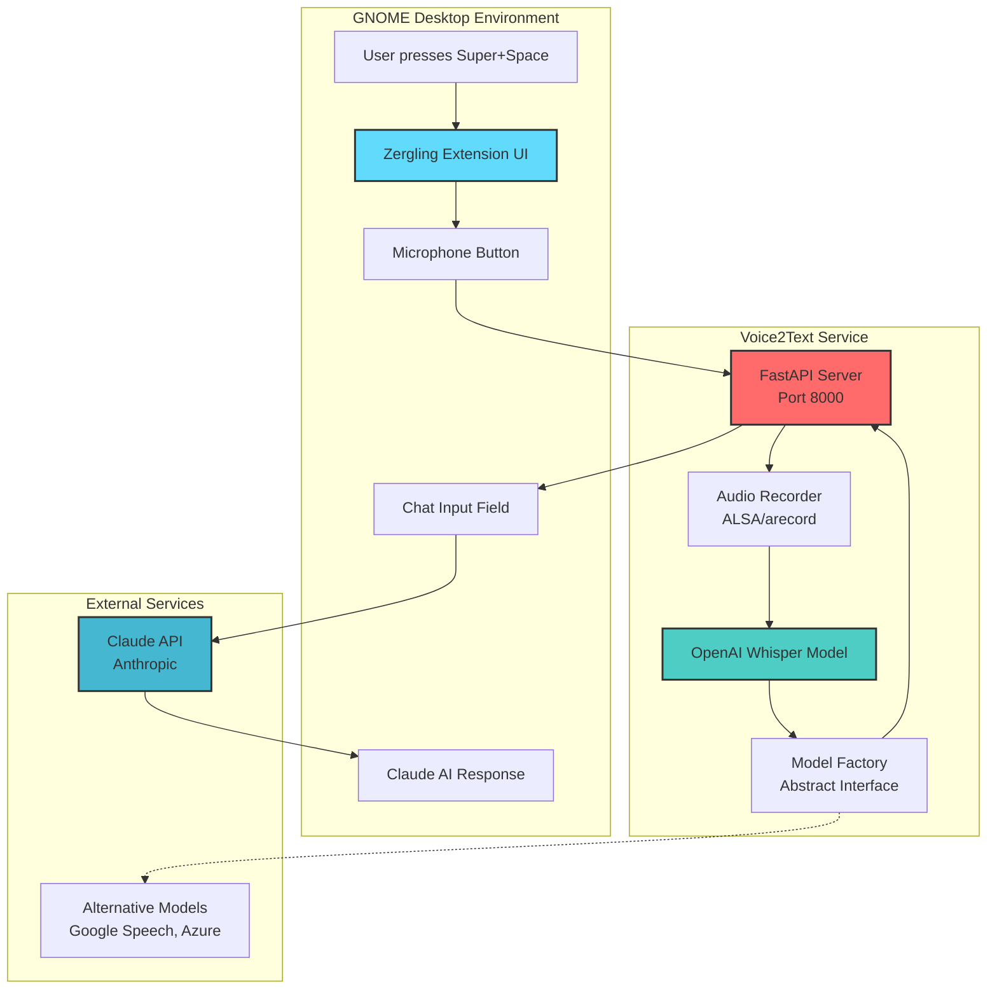

# Day 2: Adding Voice To Text

One thing I've always wanted in Linux was a way to do arbitrary voice to text. I
ultimately want to write this directly into an input field, but I'll settle for
through this extension, because then I can talk to the chatbot about my text
I've generated; it can cleanup, suggest, and improve.

I ask it to add voice to text through the google API and I provide their
documentation that links directly to the python implementation page for this
product. While Claude is coding, I start setting up a trial GCP account and
Service Account key and get my speech to text service enabled and configured. I
finish a bit before Claude does and I observe as it writes out the full python
http server (oh, you didn't choose DBUS!?) and then continues to write a few
endpoints to communicate with it.

> [!info] One of the things I love most about the AI-assisted development
> ecosystem so far is that I don't have to do boilerplate anymore. I rarely ever
> write boilerplate. I have found that comment-led development can help when
> issues arise as I describe in [Detour Autocomplete](./detour-autocomplete.md)

Truthfully, an http server is likely a better choice as it allows us to begin
abstracting the tech we're building for use within platforms that can run a
python http server! I will get to this in a future post...but I made a
minimalistic chat interface in a web app as well, and this web app could use the
same voice to text server. Although, we do have the following Linux-only
situation in the next paragraph.

It sets up the system with `arecord` which is surprisingly a good choice. ALSA
setups are very common as its a fundamental package in the Linux sound
ecosystem. It can configure the recording setup which will be great for reducing
the size of our upload and changing quality if we want. _Although it did wrongly
assess that I have the package `alsa-utils` which I did not._ Despite how
excited I am, I am absolutely not giving AI root access, so I install the
package myself, test `arecord` and then tell the robot to resume developing the
server. It was waiting to see if the server had started.

> [!warning] Cursor regularly gets hungup on foreground processes that don't
> return. Be aware of this and plan accordingly. Sometimes I have it build in to
> its system the ability to add a test parameter to cause an exit somehow, which
> allows the system to iterate on backend development autonomously.

> [!thought] At this point, I might start making this type of breakout. This is
> my thoughts callout pane. I will type stream of consciousness interruptions to
> main content in blurbs like these. Here's one coming now:
>
> I've had the blog AI write the ability to add callouts. It's quite satisfying
> to add arbitrary features to my own blog without doing anything myself. I
> still fear the day I need to heavily modify something manually.

It fires up the google server, talks to the text to speech api, uploads my
file...and has a configuration error.

> Error: sample_rate is 44100Hz when wav header says 16000Hz

Nice. So, I direct the robot to fix its configuration error, which turned out to
be a default value in the recorder that wasn't set to the same sample rate as
the api call to google. While it's fixing this I queue up the next prompt.

This time we're again modifying the UI. It doesn't have too much trouble due to
our prior re-layout of the UI to support a stacked view, a view that will layout
items horizontally. Setting the proper GJS (GnomeJS) values to allow the textbox
to expand and deny the buttons the ability to expand, the view itself is
starting to look pretty good!

Watch this:

[Voice2Text Example](/videos/voice2text.example.mp4)

Sorry for the clipping, sorting out audio through PipeWire and OBS...iykyk.

---

I'm putting a break here because I started this post on 2025-08-27, then I took
a few detour posts and had a whirlwind of a September. I'm finally back and
revisiting the Zergling project. Picking up where I left off...it looks like I
was about to record the video above, but never did! So, I recorded it today
2025-10-05, the day I marked this post as published now.

This is actually a pretty slick feature request and I'm impressed that the
system was able to connect up to the google voice service so easily. Since I'm
coming back I thought I'd take the time to investigate some of the code the AI
wrote.

_Let's do this together!_

# Investigating the code

I pulled up the chat history and it is fucking enormous. I've been using AI
tools through September to do my real work and I've learned a ton about
manipulating LLMs through their context. We've always known that this is
important...in fact, I even have a post in draft that I started on 2025-09-01
entitled [Seeding the Context](/development-tools/002-seeding-the-context). I'll
return to this article and write it so that this link works. (At time of
writing, the article is yet unpublished.)

This chat that I have to do audio recording is entitled (by Cursor) "Implement
multiline chat input features" meaning that this was the chat from when I was
designing the UI. Going forward, each major new feature will likely use a new
chat unless it directly builds on the prior chat. The reason for this is simple,
we don't want to retain more in the context than is absolutely required!

> [!thought] I'm a modular junkie. I believe so strongly in developing sound
> interfaces that expose the behavior of a given module that are thoroughly
> **internally** tested that I exploit these strong guarantees of my modules to
> avoid integration tests that do anything more than test that modules **can**
> connect properly. I'll dive into this one day in a philosophy article...I
> hope. But the point I want to make is that when I develop using AI assisted
> tools, modular development is even more potent as it restricts the amount of
> information required to load into context!
>
> Ironically, or coincidentally...who knows :shrug:, this is exactly why I so
> strongly develop modular code. Well-defined and self-contained modules reduce
> the required Cognitive Context that our brains must load in order to examine,
> implement, extend, or call the behaviors the module exposes.
>
> A less formal term for this is "Library Development". Developing a sound
> library requires that you create a relatively unchanging public interface,
> lest you write "breaking changes" in future versions, and that you guarantee
> that your code is well-tested and operates as expected. This allows library
> callers, those who use your library, to rest assured that they don't have to
> think about shit. It's going to work. It's going to do what you claim it does.
> It isn't going to break when they need it most.
>
> This has been a big stream of consciousness callout, but it's as important
> that I tell you how I intend to **instruct** the AI to develop as it is I
> reinforce myself with this philosophy.

Right, back to where we were before that extended interruption. There is so much
in this chat window that I'm not going to go back through it all. Instead I'll
give you a brief overview of what I wanted and a prompt that jump-started the
process.

I want voice2text, as this article says all over it, and I wanted local
voice2text first. I tried to get a whisper model implemented. Here's the bloated
prompt I used:

> [!prompt] this project is superb so far, but what i'd love to do is connect
> this to a whisper voice2text model or something similar so i can record my
> voice and convert that to text and communicate with my chat bot. To do this
> let's create another project in this directory, so let's move everything we
> have right now into a sub-directory and call this zergling-extension and make
> another zergling-voice2text where we'll start a server that runs the openai
> whisper model. i'll eventually package this service so we can run it with
> systemd as a service we can communicate with to do arbitrary voice2text and
> allow us to build more extensions. build this api with this in mind. when you
> are done, i should be able to hit a record button and record some audio, i
> want to see some ui for recording the audio including the length of time i'm
> recording. it would be incredible if we have a way to indicate the amount of
> audio we're getting in a signal, like a bar that increases and decreases with
> the volume of the signal, if not just fake it during recording. you will have
> built this new server that will facilitate the recording, saving of the audio
> and will be responsible for sending it through a voice to text model either
> locally or remotely, and then respond with the text. abstract the model
> interface behind a class so we can build alternate interfaces

Not a terrible prompt but you can see that I do fear the day the AI turns on me
**cough** "this project is superb so far". Maybe the AI syncophancy is rubbing
off on me...Anywho you can loosely see me describe some fo the architecture
itself. That I want a lone service, manipulate my repository to create a service
directory alongside the extension directory. This is preparing to develop a
suite of services over time that I can check for the existence of and modify the
UI accordingly. As I work...everything will exist, but that may not always be
the case. One day...maybe we'll look at some type of tool configuration to see
what is available to us and adjust the UI according to what is present, kind of
like a plugin system for video games! :thinking:

Robot goes on to do much of what I ask, even creates a systemd service
definition. By the by, I love AI for writing these simple-ish files with many
examples. I run Arch btw (AHAHAHA I snuck it in :rofl:) so I use it to build
PKGBUILD files, systemd files, other simple configurations. It's great for that.
We were given an architecture diagram...wow! And it's a mermaid diagram! This is
one of the benefits of this being a long-running chat. I think what I will need
to do going into new chats is develop a system of rules for informing the AI
what technology we're using and what to "keep in mind" when we're chatting.
Luckily, [there's an app for that](https://cursor.com/docs/context/rules).



It looks.......a little weird. The `arecord` component maps into
`OpenAI Whisper Model` and _then_ to the
`Model Factory Abstract Interface`...that doesn't seem right. However, this is
still generally what we want if we cut out this mistake, which is pretty cool.
Due to it being mermaid, we can easily edit this, too, instead of having to move
over to GIMP (GNU Image Manipulation Program, not...something else).

It ends up writing a ton of code, but it gets _really_ hung up on the inability
to reload the extension. I don't know how smart this robot thinks it is, but you
basically have to restart your gnome-shell to reload the extension. If you're
also developing an extension because you read all these articles and think it
sounds like a great idea, you can use this command to fire up a mini-shell to
experiment! `dbus-run-session -- gnome-shell --nested --wayland` and OH FUCK,
they changed it, so if you're on the latest gnome-shell (right now that's 49.0)
it's now `dbus-run-session -- gnome-shell --devkit` and...this doesn't work for
me, so that's going to be fun to debug later. Right, right, well what I was
saying up there about adding Rules for Cursor, this is one of those cases "don't
worry about reloading the extension, ya goober."

I lost the state of the code after the prompt above because I didn't at the time
know that this blog would actually be a hit among some of my peers that I
condensed the changesets into a single changeset. :shakesfist: Those damn
rebase-only developers! So let's move on to the next prompt before we really
dive into some code.

> [!prompt] i can't run the whisper model locally unfortunately, my hardware
> isn't strong enough. let's use the google speech to text api here
> @https://cloud.google.com/speech-to-text/docs/transcribe-streaming-audio#speech-streaming-recognize-python
> where we can also implement a streaming audio recognition service. implement
> the capability to stream data to the google api while i acquire the necessary
> api keys

And I supply the prompt with context the url to the speech to text docs that
exists in the prompt, but I wanted to be sure that the robot understood that
this is related and avoid relying on it potentially reaching out to that url. We
have some back and forth with some errors due to relying on the Whisper model
and related services and we finally convice the robot to move everything into
its own server module and develop a base class for audio modeling!

```python
class Voice2TextModel(ABC):
    """Abstract base class for voice-to-text models."""

    def __init__(self, config: Dict[str, Any]):
        """
        Initialize the model with configuration.

        Args:
            config: Configuration dictionary containing model-specific settings
        """
        self.config = config
        self.is_initialized = False

    @abstractmethod
    async def initialize(self) -> None:
        """Initialize the model. This may involve loading weights, connecting to APIs, etc."""
        pass

    @abstractmethod
    async def transcribe_audio(self, audio_file_path: Path) -> Dict[str, Any]:
        """
        Transcribe audio file to text.

        Args:
            audio_file_path: Path to the audio file

        Returns:
            Dictionary containing:
            - text: The transcribed text
            - confidence: Confidence score (0.0 to 1.0) if available
            - language: Detected language if available
            - duration: Audio duration in seconds
            - segments: List of segments with timestamps if available
        """
        pass

    @abstractmethod
    async def transcribe_audio_stream(self, audio_data: bytes) -> Dict[str, Any]:
        """
        Transcribe audio data from memory.

        Args:
            audio_data: Raw audio data as bytes

        Returns:
            Same format as transcribe_audio
        """
        pass

    @abstractmethod
    def get_supported_formats(self) -> list[str]:
        """Get list of supported audio formats."""
        pass

    @abstractmethod
    def get_model_info(self) -> Dict[str, Any]:
        """Get information about the model."""
        pass

    async def cleanup(self) -> None:
        """Clean up model resources. Override if needed."""
        pass

    def is_ready(self) -> bool:
        """Check if the model is ready for transcription."""
        return self.is_initialized


class ModelFactory:
    """Factory class for creating voice-to-text models."""

    _models = {}

    @classmethod
    def register_model(cls, name: str, model_class: type):
        """Register a new model type."""
        cls._models[name] = model_class

    @classmethod
    def create_model(cls, model_type: str, config: Dict[str, Any]) -> Voice2TextModel:
        """Create a model instance."""
        if model_type not in cls._models:
            raise ValueError(f"Unknown model type: {model_type}")

        return cls._models[model_type](config)

    @classmethod
    def get_available_models(cls) -> list[str]:
        """Get list of available model types."""
        return list(cls._models.keys())
```

This really isn't too bad...I'm not going to dive into this too deeply, you can
explore it yourself. The robot has made a base class that has the primary pieces
we need from an interface. Transcribing audio from some location, transcribing
from a stream, getting supported formats, and some checks for the model. We're
also provided with a factory for registering more audio models, yes!

Currently my zergling repository is not a public one. I do want to expose it,
but I may need to leverage this into a form of donations to get access which
would allow me to continue this work. I have much to do and this is my side
project, but I want to make this a full time operating-system level integration
of AI tooling that will work with cloud and local models. Consider donating
whenever I get around to creating a Patreon or something to keep this project
going. In the meantime, some snippets will have to suffice.

```python
    async def transcribe_audio_stream(self, audio_data: bytes) -> Dict[str, Any]:
        """
        Transcribe audio data from memory.

        Args:
            audio_data: Raw audio data as bytes

        Returns:
            Dict containing transcription results
        """
        if not self.client:
            await self.initialize()

        try:
            audio = speech.RecognitionAudio(content=audio_data)
            config = self.get_recognition_config()

            # Perform the transcription
            response = self.client.recognize(config=config, audio=audio)

            # Process results
            results = []
            for result in response.results:
                alternative = result.alternatives[0]
                results.append({
                    "transcript": alternative.transcript,
                    "confidence": alternative.confidence,
                    "words": [
                        {
                            "word": word.word,
                            "start_time": word.start_time.total_seconds(),
                            "end_time": word.end_time.total_seconds(),
                            "confidence": getattr(word, 'confidence', None)
                        }
                        for word in alternative.words
                    ] if self.enable_word_time_offsets else []
                })

            return {
                "text": results[0]["transcript"] if results else "",
                "confidence": results[0]["confidence"] if results else 0.0,
                "results": results,
                "language": self.language_code
            }
```

Reads audio from a bytes stream, not _exactly_ the stream I wanted as I wanted
"live translation" but it will do, and then it gets the transcribed response
from google and returns it to me. This combined with the features of the server
in the following code block give my extension back the response from google and
cleans up any of the recording audio files on my system. It actually works quite
well! Though, what I really need is a way to do live translation like Android
phones do...now _that_ would be slick.

```python
        @self.app.post("/stop_recording/{session_id}")
        async def stop_recording(session_id: str):
            """Stop recording session and return transcription."""
            if session_id not in self.active_sessions:
                raise HTTPException(status_code=404, detail="Session not found")

            session = self.active_sessions[session_id]

            # Stop recording
            session_result = await session.stop()

            if not session_result['success']:
                del self.active_sessions[session_id]
                raise HTTPException(status_code=500, detail="Recording failed")

            # Transcribe the recorded audio
            try:
                audio_path = Path(session_result['audio_file_path'])
                transcription = await self.model.transcribe_audio(audio_path)

                # Clean up
                session.recorder.cleanup_temp_file()
                del self.active_sessions[session_id]

                return {
                    "session_id": session_id,
                    "transcription": transcription,
                    "recording_info": session_result
                }

            except Exception as e:
                # Clean up on error
                if session_id in self.active_sessions:
                    self.active_sessions[session_id].recorder.cleanup_temp_file()
                    del self.active_sessions[session_id]

                raise HTTPException(status_code=500, detail=f"Transcription failed: {str(e)}")
```

Nice and straightforward, grab the audio file, send it, get the transcription
and return that to the caller. This seems to work perfectly except when I tried
to record for the video above, before the line-break and this new post from a
full month later, I noticed that all of my wav files we were recording were zero
bytes! What the fuck!?

> [!prompt] is there a way we can select the audio input source? it seems like
> we're not actually recording anything

It ends up adding a bunch of code that allows me to set the audio device, but
all I really wanted was for it to use the system default. Did we get there? Yes!

```python
def _build_recording_command(self) -> list:
        """Build the appropriate recording command based on available tools and device."""
        # Try PulseAudio first (more compatible with modern Linux)
        try:
            subprocess.run(['pactl', '--version'], capture_output=True, check=True)
            # PulseAudio is available
            if self.audio_device == 'default':
                device_arg = []
            else:
                device_arg = ['-d', self.audio_device]

            return [
                'parecord',
                '--format=s16le',
                f'--rate={self.sample_rate}',
                f'--channels={self.channels}',
                *device_arg,
                str(self.temp_file_path)
            ]
        except (subprocess.CalledProcessError, FileNotFoundError):
            pass

        # Fall back to arecord
        device_arg = [] if self.audio_device == 'default' else ['-D', self.audio_device]

        return [
            'arecord',
            '-f', 'S16_LE',
            '-c', str(self.channels),
            '-r', str(self.sample_rate),
            *device_arg,
            str(self.temp_file_path)
        ]
```

So, we end up passing the device into `arecord` which is I guess acceptable.
Looking at this code a little deeper, it seems like we may just be doing
nothing? Because I leave the `audio_device` as default, so maybe something else
helped this to magically start recording through the correct microphone.
Nonetheless, we can now record the following video (which is the same as the
video above, I'm just reposting it down here for clarity that _now_ is when I
recorded this video, not **then**). Sorry for the clipping, sorting out audio
through PipeWire and OBS...iykyk.

[Voice2Text Example](/videos/voice2text.example.mp4)

We need to do one more thing to close out this blog post though...this prompt is
going into the blog, though.

> [!prompt] I would like to be able to embed video in my blog, give us an inline
> video player so we can watch these mp4s inline or fullscreen

This is the To-do list it generated:

- Create VideoPlayer React component with inline and fullscreen support
- Add video embed syntax to markdown processing
- Add CSS styling for video player
- Test video embedding in blog post

It needed a series of components. Video Initializer that creates the video
player itself, remark processing to embed the video player when we're playing
mp4s. Then of course there's some bug:

> [!error] Syntax error: /crosscompiled-blog/app/globals.css You cannot `@apply`
> the `flex` utility here because it creates a circular dependency.

The changes rid the use of `@apply` entirely, so hopefully that doesn't bite us
later if we do theming or anything...but this blog is _mostly_ vibe coded so
:fingers-crossed:!
